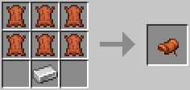
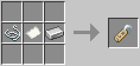
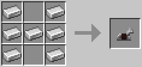
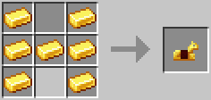

# mc-missing-recipes-mod

A Minecraft Forge mod to add recipes for crafting difficult to obtain items such as saddles, name tags, and horse armor.

## Building

In order to build the source code for the mod, follow the steps below:
1) Clone the repository to your local machine
2) Open Command Prompt (Windows) or Terminal (MacOS) in the root of the repository
3) Run the `gradlew runData` command on Windows or `./gradlew runData` command on MacOS
4) Run the `gradlew build` command on Windows or `./gradlew build` command on MacOS
5) The JAR file for the mod will be located under the build/libs folder

## Added Recipes

### Saddle

Required items:
* Leather (6)
* Iron Ingot

### Name Tag

Required items:
* String
* Paper
* Iron Ingot

### Iron Horse Armor

Required items:
* Iron Ingot (7)

### Golden Horse Armor

Required items:
* Gold Ingot (7)

